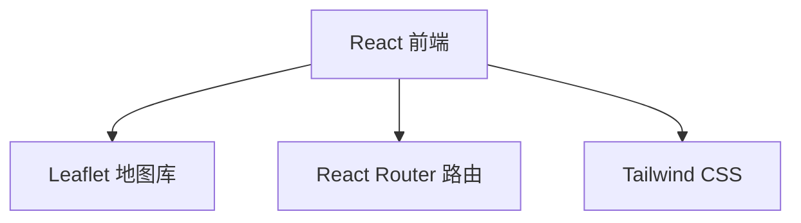

## 1. Architecture Design


## 2. Technology Description
- 前端：React@18 + TypeScript + tailwindcss@3 + vite
- 初始化工具：vite-init
- 地图库：Leaflet
- 路由：react-router-dom
- 状态管理：不需要复杂状态管理，使用 React 内置 useState/useEffect

## 3. Route Definitions
| Route | Purpose |
|-------|---------|
| / | 首页，展示个人介绍、地图和项目列表 |
| /project/:id | 项目详情页，展示特定项目的详细信息 |

## 4. 项目数据结构
```typescript
interface Project {
  id: string;
  title: string;
  type: string;
  location: string;
  coordinates: [number, number]; // [lat, lng]
  year: string;
  description: string;
  images: string[];
  details: string;
}
```

## 5. 项目数据
```typescript
const projects: Project[] = [
  {
    id: 'residential',
    title: '居住区设计',
    type: '居住建筑',
    location: '怡丰花园',
    coordinates: [30.6251, 104.0668],
    year: '2023',
    description: '现代简约风格的居住区设计，注重人与自然的和谐共处',
    images: [],
    details: '本项目位于成都市怡丰花园片区，设计理念强调社区共享空间与私密居住的平衡...'
  },
  {
    id: 'urban',
    title: '城市设计',
    type: '城市设计',
    location: '高攀路',
    coordinates: [30.6312, 104.0885],
    year: '2022',
    description: '城市更新与公共空间活化设计',
    images: [],
    details: '高攀路城市设计项目聚焦于街道空间的活化与社区活力的提升...'
  },
  {
    id: 'renewal',
    title: '城市更新',
    type: '城市更新',
    location: '玉林路',
    coordinates: [30.6457, 104.0563],
    year: '2021',
    description: '历史街区的保护性更新与文化传承',
    images: [],
    details: '玉林路城市更新项目在保留历史肌理的同时，注入新的功能与活力...'
  },
  {
    id: 'library',
    title: '大学图书馆',
    type: '文化建筑',
    location: '四川大学望江校区',
    coordinates: [30.6334, 104.0892],
    year: '2024',
    description: '现代校园文化地标建筑',
    images: [],
    details: '四川大学望江校区图书馆设计融合传统与现代，创造知识共享的空间...'
  }
];
```
