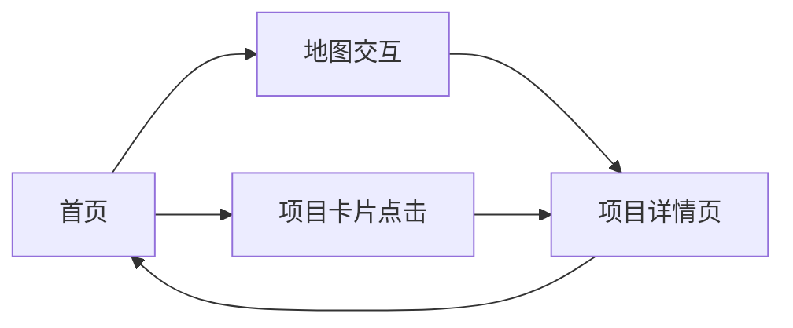

## 1. Product Overview
丁玮的个人作品集网站，展示建筑设计作品，包含交互式成都市地图和四个关键项目。
- 主要用途：展示个人建筑设计作品集，提供项目详情和地理位置信息
- 目标用户：潜在客户、合作伙伴、建筑行业专业人士

## 2. Core Features

### 2.1 Feature Module
1. **首页**: 个人介绍、导航、作品集地图展示
2. **项目详情页**: 展示每个项目的详细信息、图片、设计说明

### 2.3 Page Details
| Page Name | Module Name | Feature description |
|-----------|-------------|---------------------|
| 首页 | 英雄区 | 个人姓名、简介、欢迎信息 |
| 首页 | 导航区 | 页面导航链接 |
| 首页 | 地图区 | 交互式成都市地图，标注四个项目位置 |
| 首页 | 项目列表区 | 四个项目的卡片式预览 |
| 项目详情页 | 项目信息 | 项目名称、位置、类型、设计时间 |
| 项目详情页 | 项目描述 | 详细设计说明、理念阐述 |
| 项目详情页 | 项目图片 | 项目效果图、实景图展示 |

## 3. Core Process
用户访问网站 → 浏览首页和地图 → 点击感兴趣的项目标记或卡片 → 查看项目详情 → 返回或继续浏览其他项目

## 4. User Interface Design
### 4.1 Design Style
- 主色调：深色背景（深灰/黑色）配合暖色调（砖红/橙）点缀，体现建筑专业感
- 字体：无衬线字体，使用现代、简洁的字体组合
- 布局：全屏地图为主，卡片式项目展示，响应式设计
- 风格：简约、现代、专业，突出建筑设计作品

### 4.2 Page Design Overview
| Page Name | Module Name | UI Elements |
|-----------|-------------|-------------|
| 首页 | 英雄区 | 大字体姓名，简洁介绍，居中布局 |
| 首页 | 地图区 | 全屏 Leaflet 地图，成都为中心，自定义标记 |
| 首页 | 项目列表 | 横向排列的项目卡片，悬停效果 |
| 项目详情页 | 内容区 | 大图展示，信息分块，滚动浏览 |

### 4.3 Responsiveness
- 桌面端：全屏地图，项目卡片并排展示
- 平板/移动端：响应式布局，地图自适应，项目卡片垂直排列
- 触摸优化：地图支持手势缩放，按钮和链接适合触摸操作

### 4.4 地图配置
- 地图底图：OpenStreetMap 或 Mapbox 风格
- 中心位置：成都市
- 项目位置坐标：
  - 居住区设计（怡丰花园）
  - 城市设计（高攀路）
  - 城市更新（玉林路）
  - 大学图书馆（四川大学望江校区）
